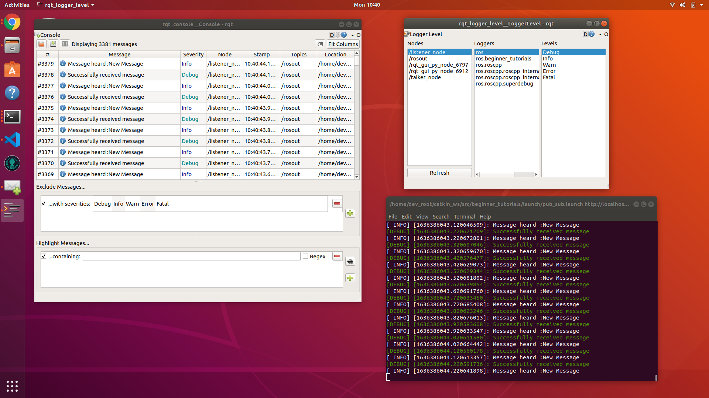

  

  
#  A simple ROS publisher & subscriber

A simple ROS publisher & subscriber package written in C++. Vallidated on Ubuntu 20.04 LTS and ROS Noetic.

## Steps to build the package

  Make a catkin workspace catkin_ws and run the following commands :
  

    cd <path_to_ws>/catkin_ws/src
    git clone https://github.com/llDev-Rootll/beginner_tutorials.git
    cd ../
    catkin_make
## Steps to run
In a terminal run :

    roscore
In another terminal run : 

    source devel/setup.bash
    rosrun beginner_tutorials talker
In another terminal run : 

    source devel/setup.bash 
    rosrun beginner_tutorials listener
    
## Steps to run the service for changing the output string

With the talker and lisener running, in a terminal run :

     rosservice call /change_output "New Message"
## Looking at the tf frames
The node talker is publishing a frame /talk with parent /world and can be viewed with the talker node running, by the command :

    rosrun tf tf_echo /world /talk
The tf tree can be viewed by running the command :

    rosrun rqt_tf_tree rqt_tf_tree

## Running the rostests
The test cases can be run by running the following commands in a terminal at the root directory of your workspace:

    catkin_make tests
    catkin_make test

 
## Steps to run using the launch file

In a terminal run :

    source devel/setup.bash
    roslaunch beginner_tutorials pub_sub.launch rate:=10 record:=true
where rate is the command line argument for changing the rate of published messages, record is the command line argument for enabling rosbag recording of ~ 15 seconds. 

Use record:=false to disable recording, for example:

    source devel/setup.bash
    roslaunch beginner_tutorials pub_sub.launch rate:=10 record:=false
## Inspecting the collected rosbag file

In the results directory run the following command to inspect the rosbag:

    rosbag info ros_bag_pub_sub.bag
## Seeing the rosbag replay in action
With a ros master & the listener node running, run the following command to run the recorded rosbag:

     rosbag play ros_bag_pub_sub.bag

 

## Running cpplint & cppcheck tests
Run the following command in the root directory to generate cpplint results in **results** folder
 
    sh run_cpplint.sh
Run the following command in the root directory to generate cppcheck results in **results** folder

    sh run_cppcheck.sh

  

*Fig 1 :  Logs*